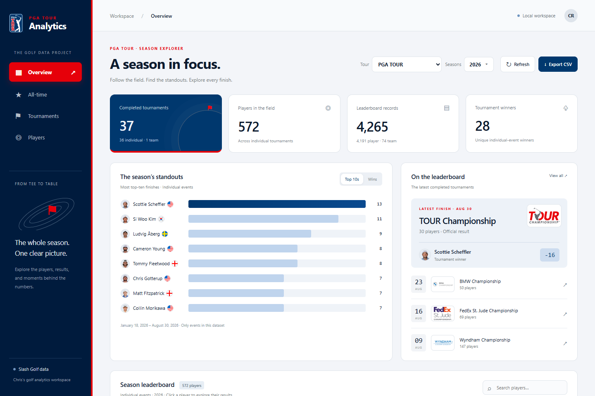
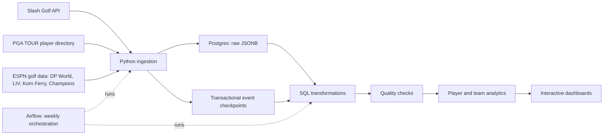
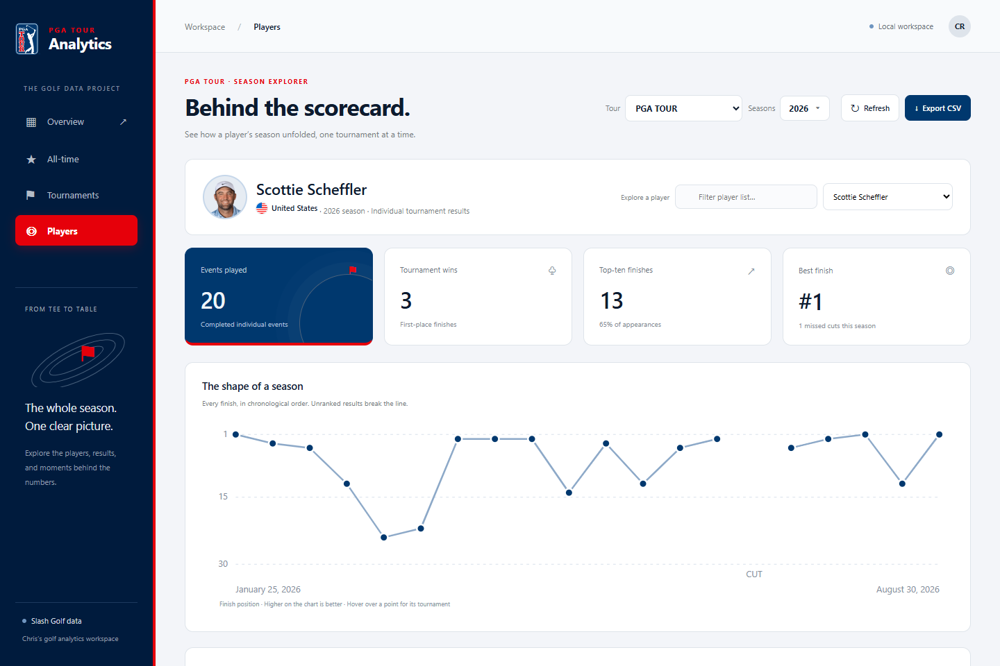

# Golf Data Engineering Pipeline

A local ELT pipeline that turns nested PGA Tour API responses into queryable player and tournament analytics, with resumable ingestion, transactional data checks, and interactive dashboards.

**Python · PostgreSQL · SQL · Apache Airflow · Docker · JavaScript**



[Watch the dashboard preview](docs/portfolio/dashboard-demo.webm) · [Two-minute demo walkthrough](docs/portfolio/demo-walkthrough.md) · [Resume and portfolio copy](docs/portfolio/resume-entry.md)

## The problem

Tournament responses contain nested player/round data, tied finishes, withdrawals, and team events. Loading them repeatedly can duplicate results; treating a team's score as an individual's can distort season statistics. This project preserves the original source and publishes validated analytics at an explicit player/tournament or team/tournament grain.

## What is working

Verified September 10, 2026:

| Dataset | Count |
|---|---:|
| Seasons loaded | 2023, 2024, 2025, 2026 (through August 30) |
| Completed events | 192 (185 individual, 7 team) |
| Player-result records | 22,609 |
| Team-result records | 358 |
| Players in individual-event analytics | 1,359 |
| Quality checks before analytics commit | 9 |
| Passing ingestion/transformation tests | 19 |
| Players with a country (PGA TOUR directory) | 793 of 1,359, covering 96% of player results |

**Other tours (ESPN, 2023–2026):**

| Tour | Individual events | Player results | Players |
|---|---:|---:|---:|
| DP World Tour | 135 | 19,199 | 1,677 |
| Korn Ferry Tour | 99 | 14,779 | 871 |
| PGA TOUR Champions | 102 | 8,437 | 622 |
| LIV Golf | 54 | 2,868 | 87 |

All five tours: 575 individual events and 67,892 player results. Every ESPN player has a country from ESPN's own data. Team and match-play events (Hero Cup, LIV Team Championship, Champions team events) are rejected at ingestion, and 2026 events not yet final are deferred.

Not loaded by design: team match play (Ryder Cup, Presidents Cup), WGC Match Play (no stroke leaderboard), and the 2025 Q-School leaderboard, which never became Official. The 2023 Grant Thornton and 2023 Q-School are still pending to preserve API quota. Players missing a country are mostly one-time starters (qualifiers, amateurs) absent from the current PGA TOUR directory.

The source schedule was refreshed September 9; the latest loaded event ended August 30. Twelve scheduled events were still in the future. Counts describe this loaded dataset, not an independently verified official PGA statistics feed.

## Architecture



- **Extract and load:** cache the schedule, request only pending completed events, and accept Official leaderboards. Save each event's raw records and its checkpoint in one transaction.
- **Transform:** use completed checkpoint snapshots, extract typed fields, convert even par to zero, retain tie/withdrawal labels, and separate team scores from individual scores.
- **Validate and publish:** rebuild derived tables and run nine checks in one transaction. Failed validation rolls back the rebuild and preserves prior analytics.
- **Orchestrate:** Airflow runs ingestion before transformation, with a ten-request execution cap and no automatic API retries. A separate Postgres instance stores Airflow metadata.
- **Explore:** dashboards use read-only database transactions. Dashboard refreshes spend no source API requests.

### Data model

| Object | Grain / purpose |
|---|---|
| `raw.slash_golf_results` | Original player or team snapshot in JSONB |
| `raw.slash_golf_schedules` | Cached schedule per tour/year |
| `ops.slash_golf_backfill` | Load status per tournament |
| `analytics.player_results` | One player per completed tournament |
| `analytics.team_results` | One team per completed tournament |
| `analytics.player_season_summary` | Individual-event season totals per player |
| `raw.pga_tour_player_directory` | One PGA TOUR directory player per snapshot, in JSONB |
| `analytics.player_directory` | Latest country and flag code per player ID |
| `raw.espn_golf_leaderboards` | One final ESPN leaderboard per non-PGA-TOUR event, in JSONB |
| `ops.espn_golf_backfill` | Load status per ESPN tour, season, and event |
| `analytics.espn_player_countries` | Latest ESPN country and flag per ESPN player |

`analytics.player_results` holds every tour: `org_id` is `1` for the PGA TOUR (Slash Golf) or the ESPN league (`eur`, `liv`, `ntw`, `champions-tour`). ESPN player IDs are stored as `espn-<id>` so they never collide with PGA TOUR IDs; the same golfer on two tours is not yet linked. Result keys use IDs rather than names. Cleaned rows retain source run IDs and raw record IDs. The independent 2024 ingestion demo and learning-script snapshots remain in raw storage but are excluded from the completed-backfill analytics.

## Dashboards

**PGA Analytics** (formerly Fairway) is the featured dashboard: season leaders, searchable/sortable player standings, tournament leaderboards, player history charts, and filtered CSV exports. Players show official PGA TOUR headshots and tournaments show their official logos, matched by ID and cached locally by `scripts/sync_images.py` (images are not committed to this repo; players without a PGA TOUR photo, mostly amateurs and qualifiers, keep an initials badge). A Tour selector switches between the PGA TOUR, DP World Tour, LIV Golf, Korn Ferry Tour, and PGA TOUR Champions; every tab works per tour. The season picker is a checklist: select one season, any combination (for example 2023, 2024, and 2025), or all seasons, and every view recalculates from player results for that selection. The All-time tab always spans every loaded season: career leaders (wins, top 10s, starts, top-10 rate with a 25-start minimum), wins by country, lowest winning scores, best single seasons, and a sortable career table with average and best finish. Every player also shows a country flag. Country comes from the PGA TOUR player directory, landed as raw JSON in `raw.pga_tour_player_directory` and modeled in `analytics.player_directory` (latest snapshot, joined by player ID). The directory is parsed from the public pgatour.com/players page rather than a documented API, so a failed refresh logs a warning and keeps the last snapshot instead of blocking results ingestion. The UI uses PGA TOUR navy and red with the TOUR shield as its brand mark; it is an unofficial fan project, not affiliated with or endorsed by the PGA TOUR.

| Version | Folder | Default / suggested port |
|---|---|---:|
| PGA Analytics working version | `dashboard/` | 8050 |
| Preserved Codex baseline | `dashboard-codex/` | 8051 with `--port 8051` |
| Clubhouse alternative | `dashboard-claude/` | 8052 |

Clubhouse also exposes raw round-level data, course/round scoring views, and pipeline coverage. See [its README](dashboard-claude/README.md) for details and scoring caveats.



The Codex baseline is preserved with hashes and screenshots. Keep future comparison work separate from `dashboard-codex/`. Both dashboard versions were built with AI assistance; the shared pipeline is the project's core engineering deliverable.

## Quick start — Windows / PowerShell

Prerequisites: Docker Desktop running, Python (3.11+; development used 3.14 locally and 3.11 inside Airflow), and Slash Golf API access through RapidAPI for a first real-data load. No database dump or API credentials are bundled.

Run the following **from the project root**. For a fresh checkout:

```powershell
py -m venv .venv
.\.venv\Scripts\python.exe -m pip install -r requirements.txt
Copy-Item .env.example .env
```

Fill in `SLASH_GOLF_API_KEY` and local database passwords in `.env`. Preserve an existing `.env`; do not run the copy command over your current configuration. Keep Airflow database credentials URL-safe because Compose embeds them in a connection URL.

Start the golf database:

```powershell
docker compose up -d postgres-golf
docker compose ps
```

Load a bounded first batch and build analytics:

```powershell
.\.venv\Scripts\python.exe pipeline.py --year 2026 --as-of 2026-09-09 --max-requests 60 --refresh-schedule
```

This may spend up to 60 API requests. Check your provider allowance first. The fixed cutoff reproduces this project's event eligibility window, but a later provider response can contain corrected data. The command creates schemas/tables on a fresh database. If it stops at its cap, completed events stay saved; rerun without `--refresh-schedule` to resume from the cached schedule.

If this project already has its data, rebuild analytics **without API requests** instead:

```powershell
.\.venv\Scripts\python.exe pipeline.py --transform-only
```

Backfill the other tours from ESPN (free, no API key; resumable, and team or match-play events are rejected):

```powershell
.\.venv\Scripts\python.exe -m ingestion.ingest_espn_tours --seasons 2023 2024 2025 2026
```

Refresh player countries without any Slash Golf requests (full pipeline runs do this automatically):

```powershell
.\.venv\Scripts\python.exe pipeline.py --transform-only --refresh-players
```

Cache player headshots, tournament logos, and country flags (about 7 MB; rerun after new players or events load, already-cached images are skipped):

```powershell
.\.venv\Scripts\python.exe scripts/sync_images.py
```

Start the featured dashboard:

```powershell
.\.venv\Scripts\python.exe dashboard/server.py
```

Open **http://localhost:8050**. Keep the terminal running; Ctrl+C stops the dashboard. Postgres must remain running. For Clubhouse, use `dashboard-claude/server.py` in a separate terminal and open port 8052.

### Airflow

```powershell
docker compose up -d --build airflow-webserver airflow-scheduler
```

Open http://localhost:8080 and sign in with the admin values from `.env`. A fresh installation starts with the DAG paused. To enable it:

```powershell
docker compose exec airflow-scheduler airflow dags unpause golf_pipeline
```

The `golf_pipeline` DAG targets the 2026 season and runs **Tuesdays at 8 a.m. America/Chicago**, while the computer and Docker are running. It refreshes the schedule, allows up to ten API requests per run, and does not automatically retry source requests. `catchup=False` avoids replaying every missed interval. The existing development installation was enabled and its first scheduled run succeeded.

Run or pause it explicitly:

```powershell
docker compose exec airflow-scheduler airflow dags trigger golf_pipeline
docker compose exec airflow-scheduler airflow dags pause golf_pipeline
```

To stop the Airflow processes while retaining the golf database:

```powershell
docker compose stop airflow-scheduler airflow-webserver
```

Named Docker volumes retain both databases. Removing volumes deletes their stored data; stopping/restarting does not require removing them.

## Tests and sample queries

Six offline tests run by default; four database integration tests skip unless opted in:

```powershell
.\.venv\Scripts\python.exe -m unittest discover -s tests -v
```

After loading data and building analytics, include the database checks:

```powershell
$env:GOLF_TEST_DATABASE = '1'
.\.venv\Scripts\python.exe -m unittest discover -s tests -v
Remove-Item Env:GOLF_TEST_DATABASE
```

Database test mutations roll back. These tests cover score/date formats, missing-row detection, independent-snapshot exclusion, and failed-rebuild rollback. The earlier Airflow DAG test and scheduler run also succeeded.

Browser checks require Node.js, the pinned Playwright dependency, Microsoft Edge, and the corresponding dashboard server running:

```powershell
npm.cmd install
npm.cmd run test:dashboard
# For Clubhouse, with its server running:
npm.cmd run test:clubhouse
```

PGA Analytics' checks (`npm run test:dashboard`) cover multi-season totals, the All-time tab, and data counts, filtering, CSV contents, player/tournament navigation, team separation, pagination, refresh, mobile layouts, and database-error handling.

Run demonstration SQL:

```powershell
Get-Content sql/demo_queries.sql -Raw | docker compose exec -T postgres-golf psql -U golf -d golf_data -v ON_ERROR_STOP=1
```

## Scope and limitations

- This is a local learning/portfolio project. It has not been deployed or operated as a production service.
- Data Golf enrichment is not implemented; its source file is a labeled placeholder. S3/Snowflake and a lakehouse are not part of this version.
- The execution request cap is not a monthly quota tracker. Completed events are not automatically reloaded when the provider corrects results.
- Season summaries cover loaded individual events only. Scores across different courses/round counts are not adjusted performance ratings.
- The dashboard source is preserved; the database remains live and can change with future loads.
- Failed or deferred ingestion prevents the downstream transformation. Review Airflow task logs or `logs/ingest_slash_golf.log`, resolve the issue, and rerun.

## Repository map

```text
config/              Shared Python logging
ingestion/          API ingestion and resumable backfill
sql/                Schemas, transformations, checks, demo queries
dags/               Airflow DAG
dashboard/          PGA Analytics UI, read-only local server, cached images
dashboard-codex/    Preserved original (Fairway) baseline
dashboard-claude/   Clubhouse alternative dashboard
tests/              Python ingestion/transformation tests
scripts/            Demo recording utilities
docs/portfolio/     Screenshots, recorded preview, walkthrough, resume copy
pipeline.py         Local entry point
docker-compose.yml  Golf Postgres + Airflow + metadata Postgres
```

Progress and earlier verification are recorded in `PROGRESSION.md`. Local workspace handoffs are retained separately in the development workspace.

References: [Airflow 2.10.4 Docker setup](https://airflow.apache.org/docs/apache-airflow/2.10.4/howto/docker-compose/index.html) · [DAG scheduling](https://airflow.apache.org/docs/apache-airflow/2.10.4/core-concepts/dag-run.html)
